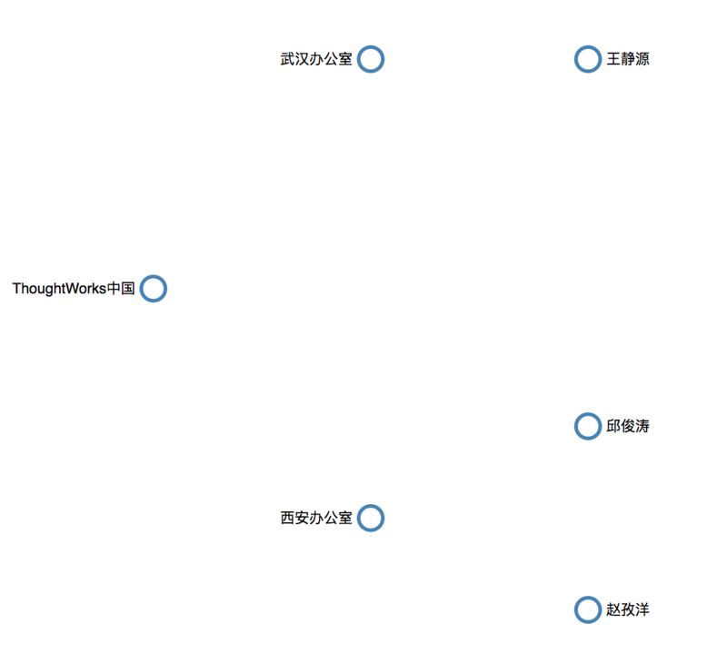

## 用D3绘制一棵树

### D3中的布局器

在D3中，有一类被称为布局器(layout)的特殊的函数（对象）。布局器通过引用一些布局算法，将输入的数据集映射成输出数据，并为输出数据附加上位置信息。

```
layout([data]) => [dataWithPosition]
```

这些附有坐标信息的数据则可以在任何地方使用，并不局限在svg本身上。举个简单的例子，给定我们有ThoughtWorks的一份各种角色的数据集合：

```js
var twers =  [
    {
      "name": "Dev",
      "size": 480,
    },
    {
      "name": "QA",
      "size": 240
    },
    {
      "name": "BA",
      "size": 120
    },
    {
      "name": "PM",
      "size": 60
    },
    {
      "name": "OP",
      "size": 10
    }
]
```

我们通过使用D3提供的饼图布局器`d3.layout.pie()`之后

```js
//通过一些参数定义一个新的布局器的pie
var pie = d3.layout.pie()
    .sort(null)
    .value(function (d) {
      return d.size;
    });

//使用这个布局器
pie(twers)    
```

D3会生成这样的数据：

```json
[
    {
        "data": {
            "name": "Dev",
            "size": 480
        },
        "value": 480,
        "startAngle": 0,
        "endAngle": 3.3142076345562654,
        "padAngle": 0
    },
    {
        "data": {
            "name": "QA",
            "size": 240
        },
        "value": 240,
        "startAngle": 3.3142076345562654,
        "endAngle": 4.971311451834398,
        "padAngle": 0
    },
    {
        "data": {
            "name": "BA",
            "size": 120
        },
        "value": 120,
        "startAngle": 4.971311451834398,
        "endAngle": 5.799863360473465,
        "padAngle": 0
    },
    {
        "data": {
            "name": "PM",
            "size": 60
        },
        "value": 60,
        "startAngle": 5.799863360473465,
        "endAngle": 6.214139314792998,
        "padAngle": 0
    },
    {
        "data": {
            "name": "OP",
            "size": 10
        },
        "value": 10,
        "startAngle": 6.214139314792998,
        "endAngle": 6.283185307179587,
        "padAngle": 0
    }
]
```

这里的`startAngle`和`endAngle`是指起始和结束的弧度数（饼图是基于2π的圆来划分的，这样弧度数会比较容易绘制）。

#### 树布局器

树布局器`d3.layout.tree()`是另外一种常见的布局器，它可以用来计算有层次结构的数据，并为其分配合适的坐标信息。

比如我们有这样的数据：

```js
var twChina = [
  {
    name: 'ThoughtWorks中国',
    parent: null,
    children: [
      {
        name: '武汉办公室',
        parent: 'ThoughtWorks中国',
        children: [
          {
            name: '王静源',
            parent: '武汉办公室'
          }
        ],
      },
      {
        name: '西安办公室',
        parent: 'ThoughtWorks中国',
        children: [
          {
            name: '邱俊涛',
            parent: '西安办公室'
          },
          {
            name: '赵孜洋',
            parent: '西安办公室'
          },
        ],
      },
    ],
  },
];
```

```js
window.onload = () => {
  //定义画布尺寸
  var width = 1600, height = 900;

  //定义布局器
  var tree = d3.layout.tree()
      .size([height, width]);

  //调用算法进行布局
  var nodes = tree.nodes(twChina[0]);

  console.log(nodes);
}
```


这样我们就可以在控制台上看到每个节点都带上了坐标信息。如果将这些节点绘制出来的话，可以看到这样的效果：

```js
var circles = nodeEnter
  .append('circle')
  .attr('r', 10)
  .attr('stroke', function(d, i) {
    return d.children || d._children ? 'steelblue' : color(i);
  })
  .style('fill', '#fff');
```



当然，通过D3，可以很容易的将节点实现为其他任何的svg元素：

```js
var rects = nodeEnter
  .append('rect')
  .attr('width', '100')
  .attr('height', '30')
  .style('fill', function(d, i) {
    return d.children || d._children ? 'steelblue' : color(i);
  });
```


### 路径生成器

为了简化对于形状的绘制，D3提供了`路径生成器`的机制，用来生成**路径**。这里的路径指的是svg中的**Path**元素。


比如有这样一个点的序列：

```js
var data = [
  {x: 1, y: 5},
  {x: 20, y: 20},
  {x: 40, y: 10},
  {x: 60, y: 40},
  {x: 80, y: 5},
  {x: 100, y: 60}
];
```

可以使用直线生成器来将这个数组绘制成一条线：

```js
var line = d3.svg.line()
  .x(function(d) { return d.x; })
  .y(function(d) { return d.y; })
  .interpolate('basis');
```

```js
d3.select('path')
	.attr('d', line(data));
```

类似的，D3提供了很多的路径生成器。要连接树的顶点，我们可以使用D3内置的对角线路径生成器：`d3.svg.diagonal()`。

#### 对角线生成器

```js
var diagonal = d3.svg.diagonal()
 .projection(function(d) { return [d.y, d.x]; });
```

然后用这个生成器结合上面一个小节中生成的树的节点，即可完成连线。


#### 贝塞尔曲线

>在数学的数值分析领域中，贝塞尔曲线（英语：Bézier curve）是计算机图形学中相当重要的参数曲线。更高维度的广泛化贝塞尔曲线就称作贝塞尔曲面，其中贝塞尔三角是一种特殊的实例。
贝塞尔曲线于1962年，由法国工程师皮埃尔·贝塞尔（Pierre Bézier）所广泛发表，他运用贝塞尔曲线来为汽车的主体进行设计。贝塞尔曲线最初由Paul de Casteljau于1959年运用de Casteljau算法开发，以稳定数值的方法求出贝塞尔曲线。

上面这段来自维基百科，简而言之，你只需要知道`贝塞尔曲线`是一个很牛逼的多项式就是了。

如果你觉得不够明白，可以看一下这个公式：


这里还有一个三阶贝塞尔的动图，注意起始点、终止点以及两个控制点的位置如何影响曲线的走向。


看不懂没关系，我也是。不过好在D3已经屏蔽了这些额外的复杂度，你只需要使用`diagonal`就可以自动获得一个三阶的贝塞尔函数，当然代价是你比较难定制曲线的
形状。

### 其他定制

#### 横过来

如果要将整个树横过来，我们需要将节点的X，Y互换，然后将对角线的X，Y互换：

```js
var nodeEnter = node
  .enter()
  .append('g')
  .attr('class', 'node')
  .attr('transform', function(d) {
    return 'translate(' + d.x + ',' + d.y + ')';
  });
```

```js
var diagonal = d3.svg.diagonal()
 .projection(function(d) { return [d.x, d.y]; });
```

上图中用的是长方形，而布局器生成的是长方形的（top,left）坐标，需要加上一些偏移量（长方形宽度的一半）。

```js
var nodeWidth = 100, nodeHeight = 30;
var diagonal = d3.svg.diagonal()
 .projection(function(d) { return [d.x+nodeWidth/2, d.y+nodeHeight/2]; });
```


#### 更多的数据

再加入一些其他的数据，即可生成比较丰满的树形结构。不过如果某一个层次的节点数太多，节点之间会互相重合：


我们可以借助树布局器的自动布局功能，在初始化时，制定每个节点的大小。这样D3会自动计算节点间的间距：

```js
var tree = d3.layout.tree().nodeSize([nodeWidth+20, nodeHeight])
```

即，不指定画布的大小，而是指定每个节点的大小。


### 动态数据

上面的例子中，我们将`inline`的数据绘制成了svg图。如果数据需要动态获取，原理也是一样，D3本身就提供了一些`ajax`的包装：

- d3.csv 请求并尝试将response按照csv格式解析
- d3.json 请求并尝试将response按照json格式解析
- d3.text 请求并尝试将response按照纯文本格式解析

比如：

```js
d3.json('/tree.json', function(error, data) {
  console.log(data);
})
```

在回调中，可以直接使用上述的函数来进行数据的渲染。

### 其他参考

D3中提供了众多的布局器，其他常用的还有：

- Pie - 饼图生成器
- Bundle（Holten分层绑线算法）
- Force（基于引力的布局算法）
- Treemap（树图）
- Partition（径向的Treemap）

这里有[JSFiddle的链接](https://jsfiddle.net/juntao/qnxkb6vs/4/)，你可以去看一看实际的运行结果，也可以fork下来自己改。
